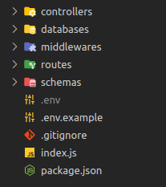

# `kiro-project`
*This is a cli to automate the installation and organize code through templates*
## Usage
### 1 - **Express with mongo**

```bash
npx kiro-project expressmongo -y -i
```

template:
<div>
    
</div>


### 2 - **Only express**

```bash
npx kiro-project express -y -i
```
template:
<div>
    
</div>

## License

MIT

## Collaborators

- Mateus Figueiredo <figueiredo1497@gmail.com>