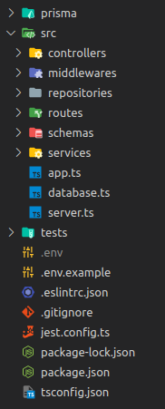
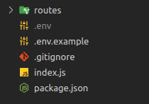

# `kiro-project`
*This is a cli to automate the installation and organize code through templates*
## Usage - First: create your project folder and inside it use one of the commands below 
### 1 - **Express with Typescript**

```bash
 npx kiro-project typescript -y -i -g
```

template:
<div>
    
</div>


### 2 - **Only express**

```bash
npx kiro-project express -y -i -g
```
template:
<div>
    
</div>

## Commands
| Abbr | Command |
|---|---|
| -g | --git |
| -i | --install |
| -y | --yes |
## License

MIT

## Collaborators

- Mateus Figueiredo <figueiredo1497@gmail.com>
## Contact

[![LinkedIn][linkedin-shield]][linkedin-url]

<!-- MARKDOWN LINKS & IMAGES -->

[linkedin-shield]: https://img.shields.io/badge/-LinkedIn-black.svg?style=for-the-badge&logo=linkedin&colorB=blue
[linkedin-url]: https://www.linkedin.com/in/mateus-figueiredo-pereira/